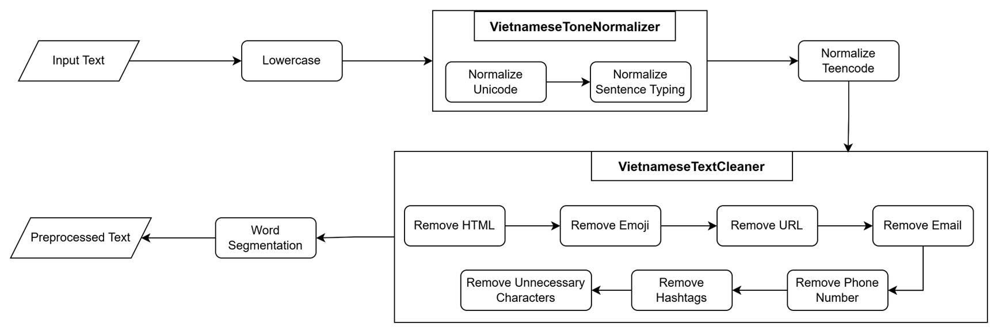
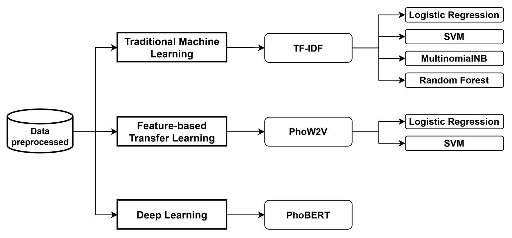
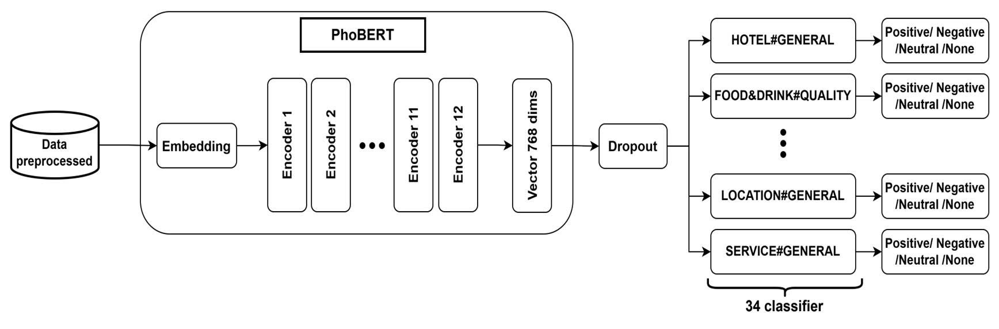

# Hotel Aspect-Based Sentiment Analysis (ABSA)
Repo này trình bày chi tiết toàn bộ quy trình từ thu thập dữ, gán nhãn dữ liệu, tiền xử lý dữ liệu, đánh giá các mô hình Machine Learning và Deep Learning.

# PART 1: THE TOOL & INSTALLATION
Giới thiệu về ứng dụng web hỗ trợ gán nhãn và phân tích.

## 1. Giới thiệu công cụ
Ứng dụng bao gồm các chức năng chính: Tiền xử lý, Gán nhãn (Annotation) và Phân loại câu.
* **Manually Annotation Tool:** Gán nhãn thủ công (HTML/JS).
* **Semi-Annotation Tool:** Gán nhãn bán tự động sử dụng mô hình học máy (Streamlit).

## 2. Cài đặt & Yêu cầu
* **Yêu cầu:** Python 3.8+, Java (để chạy VnCoreNLP).
* **Thư viện:** Xem `requirements.txt`.

### Các bước cài đặt:
1.  **Clone Repository:**
    ```bash
    git clone [https://github.com/tranminhvu945/DS102.git](https://github.com/tranminhvu945/DS102.git)
    ```
2.  **Cài đặt thư viện:**
    ```bash
    pip install -r requirements.txt
    ```
3.  **Setup Mô Hình:**
    *   Phải đảm bảo bạn có file model `pipe.joblib` đã được huấn luyện trong root directory
    *   Đặt tệp này vào thư mục `./model/` (tạo thư mục `model` nếu chưa có).

## 3. Hướng dẫn chạy
* **Tool thủ công:** Mở file `index.html` (dùng Live Server).
* **Tool bán tự động:**
    ```bash
    streamlit run main.py
    ```

---

# PART 2: DATA SCIENCE WORKFLOW
Chi tiết quy trình xây dựng mô hình từ dữ liệu thô.

## I. Data Collection & Labeling
1.  **Nguồn dữ liệu:** [TripAdvisor Vietnam](https://www.tripadvisor.com.vn/)
2.  **Guideline gán nhãn:** 
3.  **Quy trình thực hiện:**
    * **Training Annotators:**
        
    * **Official Labeling:**
        

## II. Data Overview
Thống kê bộ dữ liệu sau khi thu thập:

| Dataset | No. Reviews | No. Aspect| Avg. Length | Vocab Size | Out of Vocab (vs Train) |
|:----------:|:--------:|:-------:|:-------:|:---------:|:---------:|
| [Train](./Data/Original/1-train.txt) | 1658 | 7109 | 54 | 5994 | - |
| [Val](./Data/Original/2-val.txt) | 359 | 1558 | 58 | 2558 | 689 |
| [Test](./Data/Original/3-test.txt) | 372 | 1597 | 56 | 2722 | 796 |
| [Full](./Data/data_full.txt) | 2389 | 10624 | 55 | 7413 | - |

- The **Hotel** domain consists of **34** following **`Aspect#Category`** pairs:

```python
['FACILITIES#CLEANLINESS', 'FACILITIES#COMFORT', 'FACILITIES#DESIGN&FEATURES', 'FACILITIES#GENERAL', 'FACILITIES#MISCELLANEOUS', 'FACILITIES#PRICES', 'FACILITIES#QUALITY', 'FOOD&DRINKS#MISCELLANEOUS', 'FOOD&DRINKS#PRICES', 'FOOD&DRINKS#QUALITY', 'FOOD&DRINKS#STYLE&OPTIONS', 'HOTEL#CLEANLINESS', 'HOTEL#COMFORT', 'HOTEL#DESIGN&FEATURES', 'HOTEL#GENERAL', 'HOTEL#MISCELLANEOUS', 'HOTEL#PRICES', 'HOTEL#QUALITY', 'LOCATION#GENERAL', 'ROOMS#CLEANLINESS', 'ROOMS#COMFORT', 'ROOMS#DESIGN&FEATURES', 'ROOMS#GENERAL', 'ROOMS#MISCELLANEOUS', 'ROOMS#PRICES', 'ROOMS#QUALITY', 'ROOM_AMENITIES#CLEANLINESS', 'ROOM_AMENITIES#COMFORT', 'ROOM_AMENITIES#DESIGN&FEATURES', 'ROOM_AMENITIES#GENERAL', 'ROOM_AMENITIES#MISCELLANEOUS', 'ROOM_AMENITIES#PRICES', 'ROOM_AMENITIES#QUALITY', 'SERVICE#GENERAL']
```
## III. Preprocessing
Quy trình tiền xử lý dữ liệu đóng vai trò quan trọng để chuẩn hóa văn bản tiếng Việt trước khi đưa vào mô hình.

**Sơ đồ quy trình xử lý chung:**


### Các bước thực hiện chi tiết:

1.  **VietnameseTextCleaner:**
    * Sử dụng Regex đơn giản để làm sạch văn bản.
    * Loại bỏ: HTML tags, Emoji, URL, Email, Số điện thoại, Hashtags và các ký tự nhiễu khác.

2.  **VietnameseToneNormalizer:**
    * Chuẩn hóa bảng mã Unicode (ví dụ: đảm bảo tính nhất quán giữa các ký tự nhìn giống nhau nhưng khác mã).
    * Chuẩn hóa kiểu bỏ dấu câu (ví dụ: chuyển `lựơng` $\rightarrow$ `lượng`, `thỏai mái` $\rightarrow$ `thoải mái`).

3.  **Word Segmentation (Tách từ):**
    * Sử dụng thư viện **[VnCoreNLP](https://github.com/vncorenlp/VnCoreNLP)** để tách từ tiếng Việt.
    * **Lý do lựa chọn:** PhoBERT sử dụng *RDRSegmenter* của VnCoreNLP trong quá trình pre-training. Việc sử dụng cùng một công cụ tách từ giúp đảm bảo tính tương thích tốt nhất cho mô hình ([Tham khảo Note của PhoBERT](https://github.com/VinAIResearch/PhoBERT#-notes)).
    * *Lưu ý:* Script tự động tải các thành phần cần thiết của VnCoreNLP đã được tích hợp sẵn trong thư mục `./processors/VnCoreNLP`, bạn không cần cài đặt thủ công.

### Minh họa (Example)
> **Input:** “Nv nhiệt tình, phòng sạch sẽ, tiện nghi, vị trí khá thuận tiện cho việc di chuyển đến các địa điểm khác 😍😍😍.”
>
> **Output:** “nhân_viên nhiệt_tình phòng sạch_sẽ tiện_nghi vị_trí khá thuận_tiện cho việc di_chuyển đến các địa_điểm khác”

📂 **Dữ liệu đã tiền xử lý:** [Xem tại thư mục ./Data/Preprocessed/](./Data/Preprocessed/)

## IV. Modeling
Quá trình huấn luyện và đánh giá mô hình được thực hiện chi tiết trong Notebook.

👉 **Notebook Training:** [training.ipynb](./model_training.ipynb)

### Các phương pháp tiếp cận (Approaches)
Dự án thực nghiệm trên hai nhóm mô hình chính:

1.  **Machine Learning:**
    * Sử dụng các đặc trưng: **TF-IDF**, **PhoW2V**.
    * Các thuật toán: Logistic Regression, Linear SVC, Non-Linear SVC, Multinomial NB, Random Forest.
    

2.  **Deep Learning:**
    * Sử dụng **PhoBERT** (Pre-trained language model cho tiếng Việt) để Fine-tune cho bài toán ABSA.
    

---

## V. Experimental Results

Bảng dưới đây so sánh hiệu suất (F1-score) giữa các mô hình trên tập Validation và Test set.

| Approach | Feature | Model | Val (F1) | Test (F1) |
| :---: | :---: | :--- | :---: | :---: |
| **Machine Learning** | **TF-IDF** | Logistic Regression | $\textcolor{green}{68.82}$ | $\textcolor{green}{70.33}$ |
| | | Linear SVC | 68.27 | 70.16 |
| | | Non-Linear SVC | 64.47 | 65.95 |
| | | Multinomial NB | 63.03 | 63.08 |
| | | Random Forest | 67.23 | 68.78 |
| | **PhoW2V** | Logistic Regression | 63.63 | 65.25 |
| | | Linear SVC | 64.11 | 64.32 |
| | | Non-Linear SVC | 63.98 | 64.36 |
| **Deep Learning** | **-** | **PhoBERT** | $\textcolor{red}{72.29}$ | $\textcolor{red}{73.83}$ |

> **Nhận xét:** Mô hình **PhoBERT** cho kết quả vượt trội nhất trên cả tập Val và Test, chứng minh hiệu quả của việc sử dụng Pre-trained model cho xử lý ngôn ngữ tự nhiên tiếng Việt.


<!-- 
# I. Data Collection & Labeling the data
1. Dữ liệu được được thu thập từ trang web TripAdvisor: https://www.tripadvisor.com.vn/
2. Guideline hướng dẫn gán nhãn: 
3. Quy trình: 
* **Training Annotators**

* **Labeling the data**


4. Công Cụ Phân Tích Cảm Xúc Đa Khía Cạnh Khách Sạn
* Repo này chứa mã nguồn cho một ứng dụng web hỗ trợ phân tích cảm xúc đa khía cạnh (Aspect-Based Sentiment Analysis - ABSA) cho các đánh giá khách sạn. 
* Ứng dụng bao gồm các công cụ chính: Tiền xử lý dữ liệu, Gán nhãn dữ liệu, và Phân loại câu đơn. 

Trong đó, annotation tool có 2 loại: 
*  Manually Annotation Tool: gán nhãn thủ công được viết bằng html , js, css.
*  Semi-Annotation Tool: gán nhãn bán tự động sử dụng mô hình học máy

## Yêu Cầu
*   Python 3.8+
*   Các thư viện được liệt kê trong `requirements.txt`.
*   Cài đặt Java để chạy VnCoreNLP

## Cài Đặt

1.  **Clone Repository:**
    ```bash
    git clone https://github.com/tranminhvu945/DS102.git
    ```

2.  **Cài đặt thư viện:**
    ```bash
    pip install -r requirements.txt
    ```

3.  **Mô Hình:**
    *   Phải đảm bảo bạn có file model `pipe.joblib` đã được huấn luyện trong root directory
    *   Đặt tệp này vào thư mục `./model/` (tạo thư mục `model` nếu chưa có).

## Chạy Ứng Dụng
*  Tool gán nhãn thủ công: **Chạy Go Live file index.html**
*  Tool gán nhãn bán tự động: Sử dụng Streamlit để chạy ứng dụng:

   ```bash
   streamlit run main.py
   ```

# II. Data Overview
|  Dataset | No. Reviews | No. Aspect| Avg. Length | Vocab Size | No. words in `Test`/`Dev` not in `Train` set |
|:----------:|:--------:|:-------:|:-------:|:---------:|:---------:|:---------:|
|[Train](./Data/Original/1-train.txt) |  1658  |  7109 |     54    |   5994   |     -     |
|[Val](./Data/Original/2-val.txt)   |  359  |  1558  |     58    |   2558   |   689   |
|[Test](./Data/Original/3-test.txt)   |   372   |  1597  |     56    |   2722   |    796    |
|[Full](./Data/data_full.txt) |  2389  |  10624  |     55    |   7413   |     -     |

- The **Hotel** domain consists of **34** following **`Aspect#Category`** pairs:

```python
['FACILITIES#CLEANLINESS', 'FACILITIES#COMFORT', 'FACILITIES#DESIGN&FEATURES', 'FACILITIES#GENERAL', 'FACILITIES#MISCELLANEOUS', 'FACILITIES#PRICES', 'FACILITIES#QUALITY', 'FOOD&DRINKS#MISCELLANEOUS', 'FOOD&DRINKS#PRICES', 'FOOD&DRINKS#QUALITY', 'FOOD&DRINKS#STYLE&OPTIONS', 'HOTEL#CLEANLINESS', 'HOTEL#COMFORT', 'HOTEL#DESIGN&FEATURES', 'HOTEL#GENERAL', 'HOTEL#MISCELLANEOUS', 'HOTEL#PRICES', 'HOTEL#QUALITY', 'LOCATION#GENERAL', 'ROOMS#CLEANLINESS', 'ROOMS#COMFORT', 'ROOMS#DESIGN&FEATURES', 'ROOMS#GENERAL', 'ROOMS#MISCELLANEOUS', 'ROOMS#PRICES', 'ROOMS#QUALITY', 'ROOM_AMENITIES#CLEANLINESS', 'ROOM_AMENITIES#COMFORT', 'ROOM_AMENITIES#DESIGN&FEATURES', 'ROOM_AMENITIES#GENERAL', 'ROOM_AMENITIES#MISCELLANEOUS', 'ROOM_AMENITIES#PRICES', 'ROOM_AMENITIES#QUALITY', 'SERVICE#GENERAL']
```

# II. Preprocessing
**Quy trình xử lý chung**


**(a) VietnameseTextCleaner**: Simple regex-based text cleaning to remove HTML, Emoji, URL, Email, Phone Number, Hashtags, and other unnecessary characters.
**(b) VietnameseToneNormalizer**: Normalize Unicode (eg., `'ờ' != 'ờ'`) and sentence typing (eg., `lựơng` => `lượng`, `thỏai mái` => `thoải mái`).
**(c) Word Segmentation**: 
    - Use [VnCoreNLP](https://github.com/vncorenlp/VnCoreNLP) to segment Vietnamese words. 
    - This tool is chosen because: "[PhoBERT employed the RDRSegmenter from VnCoreNLP to pre-process the pre-training data](https://github.com/VinAIResearch/PhoBERT#-notes)". 
    - I already implemented script to automatically download necessary components of this tool into the [VnCoreNLP folder](./processors/VnCoreNLP), so you don't need to do anything.

**Example:**  
- Input text: “Nv nhiệt tình, phòng sạch sẽ, tiện nghi, vị trí khá thuận tiện cho việc di chuyển đến các địa điểm khác 😍😍😍.”
-  Output: “nhân_viên nhiệt_tình phòng sạch_sẽ tiện_nghi vị_trí khá thuận_tiện cho việc di_chuyển đến các địa_điểm khác”

**Data đã được tiền xử lý được cung cấp tại**: 

# III. Modeling
👉 **Notebook Model Training**: [training.ipynb](./model_training.ipynb)

**Approaches**

**Áp dụng PhoBERT cho ABSA Hotel**


# IV. Experimental Results
| Approach | Feature | Model | Val (F1) | Test (F1) |
| :---: | :---: | :--- | :---: | :---: |
| **Machine Learning** | **TF-IDF** | Logistic Regression | $\textcolor{green}{68.82}$ | $\textcolor{green}{70.33}$ |
| | | Linear SVC | 68.27 | 70.16 |
| | | Non-Linear SVC | 64.47 | 65.95 |
| | | Multinomial NB | 63.03 | 63.08 |
| | | Random Forest | 67.23 | 68.78 |
| | **PhoW2V** | Logistic Regression | 63.63 | 65.25 |
| | | Linear SVC | 64.11 | 64.32 |
| | | Non-Linear SVC | 63.98 | 64.36 |
| **Deep Learning** | **-** | **PhoBERT** | $\textcolor{red}{72.29}$ | $\textcolor{red}{73.83}$ | -->
